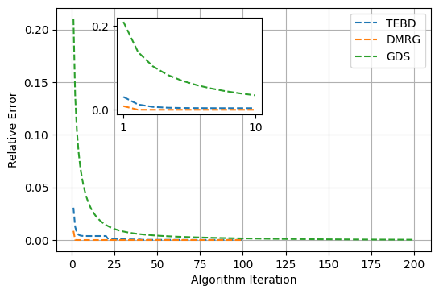

# Gradient Descent Optimization of MPS for Ground State Finding

**Computational Methods for Many Body Physics, August 2022**

In this paper I will explore the implementation of the gradient descent method (GDS) to find the ground state of the Ising Hamiltonian employing Matrix Product States (MPS) algorithms. After a brief theoretical introduction, I explore the parameter regimes that best suit the algorithm, including the optimization of the ansatz state, learning rate, and Hamiltonian parameters. The comparison of GDS against other well-known algorithms for ground state preparation, such as TEBD and DMRG, showcases the deficiencies of the algorithm. I then finalize the work with a discussion of possible improvements as well as comments on its implementation.

Full report: [here](/report.pdf)

----
## Author:

* @EmilianoG-byte: Cristian Emiliano Godinez Ramirez